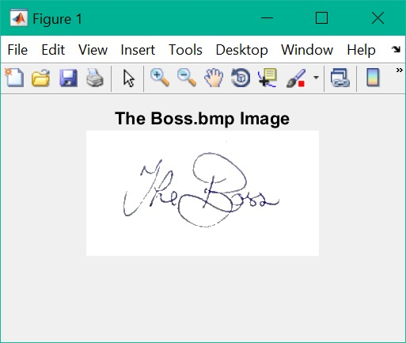

**Signature Image Extractor**
========================

Introduction
------------------------
This is originally an assignment from Image Processing module -- Master Forgery. This project aims to locate and extract the signature from any natural image and clean and crop to only the signature itself.

Results
------------------------
| Original | Processed |
| :---: |:---:|
|  |  |

Introduction
------------------------
In a sneaky move, you have slipped in to The Boss's office and snapped a piccie of his signature ([Boss.bmp](Boss.bmp)). Full of nefarious plans to empty the company accounts, you slap it into an official document only to find very disappointing, unconvincing results ([Signature.pdf](Signature.pdf)). Use your newly acquired Image Processing prowess to clean Boss.bmp to give a more convincing and usable signature for your forged documents. 

- Make sure the system cleans the whole picture and not just the signature;

- Adaptive thresholding and segmentation masking would work well here;

- Challenge : Find, isolate and clean the signature of the idiot pictured in [Trump.jpg](Trump.jpg);

- Refer to the general guidelines to maximise your marks;

- Submit a single m-file here.

Licensing
------------------------
Please see the file named [LICENSE.md](LICENSE.md).

Author
------------------------
* Chen Yumin  

Contact
------------------------
* Chen Yumin: [*http://chenyumin.com/*][1]
* CharmySoft: [*http://CharmySoft.com/*][2]  
* About: [*http://CharmySoft.com/about*][3]  
* Email: [*hello@chenyumin.com*](mailto:hello@chenyumin.com)  

[1]: http://chenyumin.com/ "Chen Yumin"
[2]: http://www.CharmySoft.com/ "CharmySoft"
[3]: http://www.CharmySoft.com/about "About CharmySoft"